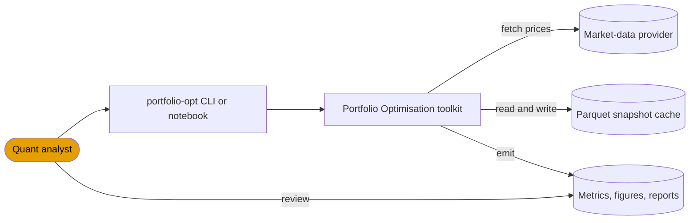
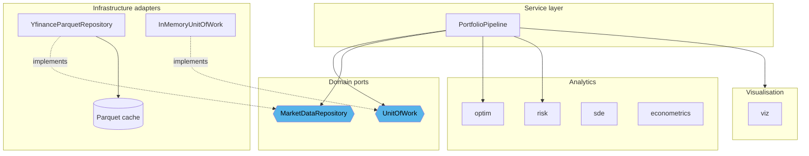
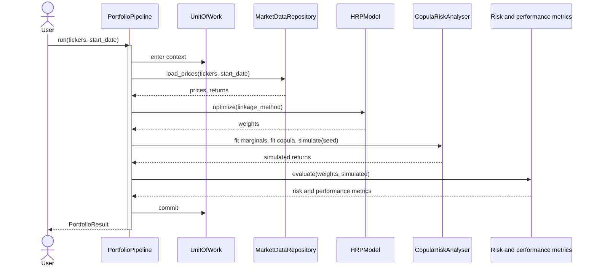

# Architecture

The package is organised into domain-driven layers with strict dependency
inversion. The domain layer is pure (no IO, no framework coupling);
infrastructure adapters implement domain protocols; analytics layers depend only
on the domain, configuration and infrastructure; visualisation consumes
analytics outputs; and the service layer orchestrates the whole flow.

## System context

The toolkit sits between an analyst and two external resources, a market-data
provider for prices and a local store for the cached snapshot and the emitted
artefacts.



## Components and ports

The service layer depends on the domain protocols rather than on concrete
infrastructure. The yfinance and parquet adapter implements the repository port,
so a test or an alternative data source substitutes it without touching the
analytics or service code.



## Layer dependencies

The graph below is generated from the source by `tools/gen_diagrams.py` and kept
in sync by continuous integration. Any edge that would violate the layering (for
example the domain depending on infrastructure, or an analytics layer depending
on visualisation) is detected by the generator and by a dedicated test.

```mermaid
--8<-- "docs/diagrams/layer_dependencies.mmd"
```

## Module dependencies

```mermaid
--8<-- "docs/diagrams/module_dependencies.mmd"
```

## Runtime flow

The standard pipeline fetches prices through the repository, allocates with
hierarchical risk parity, simulates the loss distribution, computes the risk and
performance metrics, and commits the unit of work before returning the result.



## Regenerating the diagrams

```bash
python tools/gen_diagrams.py          # regenerate docs/diagrams/*
python tools/gen_diagrams.py --check  # verify the diagrams match the source
```

When the Graphviz `dot` binary is available the generator also renders SVG
copies alongside the Mermaid and DOT sources.

## Rationale

The reasoning behind the layering and the key infrastructure patterns is
recorded in the decision records:

- [DDD layering](adr/0001-ddd-layering.md)
- [Repository and Unit of Work](adr/0002-repository-unit-of-work.md)
- [Deterministic seeding](adr/0003-deterministic-seeding.md)
