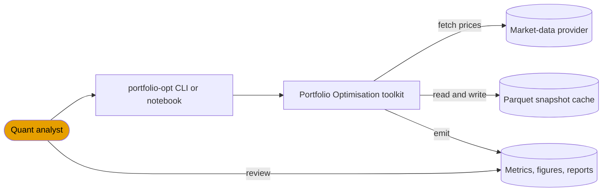
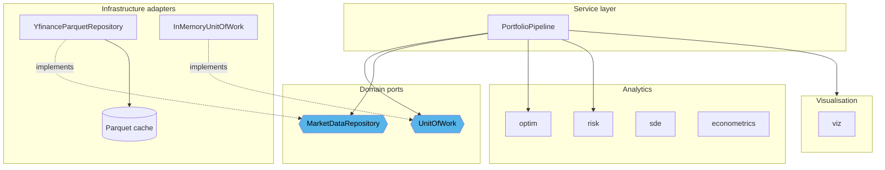
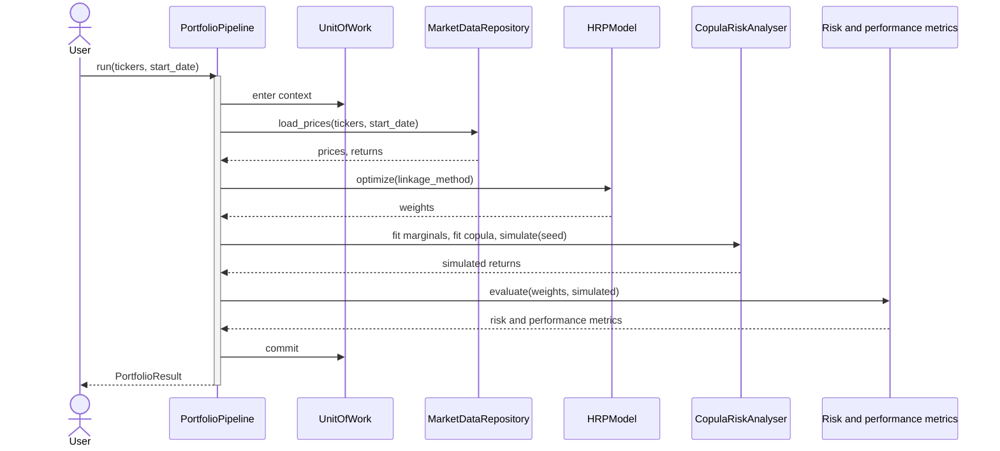

# Architecture

The package is organised into domain-driven layers with strict dependency
inversion. The domain layer is pure (no IO, no framework coupling);
infrastructure adapters implement domain protocols; analytics layers depend only
on the domain, configuration and infrastructure; visualisation consumes
analytics outputs; and the service layer orchestrates the whole flow.

## System context

The toolkit sits between an analyst and two external resources, a market-data
provider for prices and a local store for the cached snapshot and the emitted
artefacts.


```mermaid
flowchart LR
    analyst([Quant analyst]):::actor
    entry[portfolio-opt CLI or notebook]
    system[Portfolio Optimisation toolkit]
    market[(Market-data provider)]
    cache[(Parquet snapshot cache)]
    outputs[(Metrics, figures, reports)]
    analyst --> entry --> system
    system -->|fetch prices| market
    system -->|read and write| cache
    system -->|emit| outputs
    analyst -->|review| outputs
    classDef actor fill:#E69F00,color:#000;
```

## Components and ports

The service layer depends on the domain protocols rather than on concrete
infrastructure. The yfinance and parquet adapter implements the repository port,
so a test or an alternative data source substitutes it without touching the
analytics or service code.


```mermaid
flowchart TB
    subgraph svc[Service layer]
        pipe[PortfolioPipeline]
    end
    subgraph dom[Domain ports]
        repop{{MarketDataRepository}}
        uowp{{UnitOfWork}}
    end
    subgraph inf[Infrastructure adapters]
        yfa[YfinanceParquetRepository]
        uowa[InMemoryUnitOfWork]
        store[(Parquet cache)]
    end
    subgraph ana[Analytics]
        opt[optim]
        rsk[risk]
        sde[sde]
        eco[econometrics]
    end
    subgraph vis[Visualisation]
        viz[viz]
    end
    pipe --> uowp
    pipe --> repop
    pipe --> opt
    pipe --> rsk
    pipe --> vis
    yfa -. implements .-> repop
    uowa -. implements .-> uowp
    yfa --> store
    classDef port fill:#56B4E9,color:#000;
    class repop,uowp port;
```

## Layer dependencies

The layering is a contract in [`.importlinter`](../.importlinter), checked by
[import-linter](https://import-linter.readthedocs.io/) as a commit hook and in
CI: each layer may import the layers below it and not those above, and layers on
one line are independent of each other. From top to bottom: `cli`, `services`,
`viz`, then `optim`, `risk`, `sde` and `econometrics` side by side, then
`infra`, then `domain` and `config` side by side. An edge that breaks the order,
the domain depending on infrastructure or an analytics layer on visualisation,
fails `lint-imports`.

## Module dependencies

The module graph is drawn from the source by
[pydeps](https://github.com/thebjorn/pydeps) when the site is built, so it is
never stale and never committed.


## Runtime flow

The standard pipeline fetches prices through the repository, allocates with
hierarchical risk parity, simulates the loss distribution, computes the risk and
performance metrics, and commits the unit of work before returning the result.


```mermaid
sequenceDiagram
    actor User
    participant Pipeline as PortfolioPipeline
    participant UoW as UnitOfWork
    participant Repo as MarketDataRepository
    participant HRP as HRPModel
    participant Sim as CopulaRiskAnalyser
    participant Metrics as Risk and performance metrics
    User->>Pipeline: run(tickers, start_date)
    activate Pipeline
    Pipeline->>UoW: enter context
    Pipeline->>Repo: load_prices(tickers, start_date)
    Repo-->>Pipeline: prices, returns
    Pipeline->>HRP: optimize(linkage_method)
    HRP-->>Pipeline: weights
    Pipeline->>Sim: fit marginals, fit copula, simulate(seed)
    Sim-->>Pipeline: simulated returns
    Pipeline->>Metrics: evaluate(weights, simulated)
    Metrics-->>Pipeline: risk and performance metrics
    Pipeline->>UoW: commit
    Pipeline-->>User: PortfolioResult
    deactivate Pipeline
```

## Checking the layering and drawing the graph

```bash
uv run lint-imports                                  # the contract in .importlinter
uv run pydeps portfolio_optimisation --noshow --only portfolio_optimisation \
  -T svg -o docs/module_dependencies.svg    # needs Graphviz's dot
```

The docs workflow runs both before `mkdocs build`, so the published graph is
drawn from the commit it documents.

## Rationale

The reasoning behind the layering and the key infrastructure patterns is
recorded in the decision records:

- [DDD layering](adr/0001-ddd-layering.md)
- [Repository and Unit of Work](adr/0002-repository-unit-of-work.md)
- [Deterministic seeding](adr/0003-deterministic-seeding.md)
